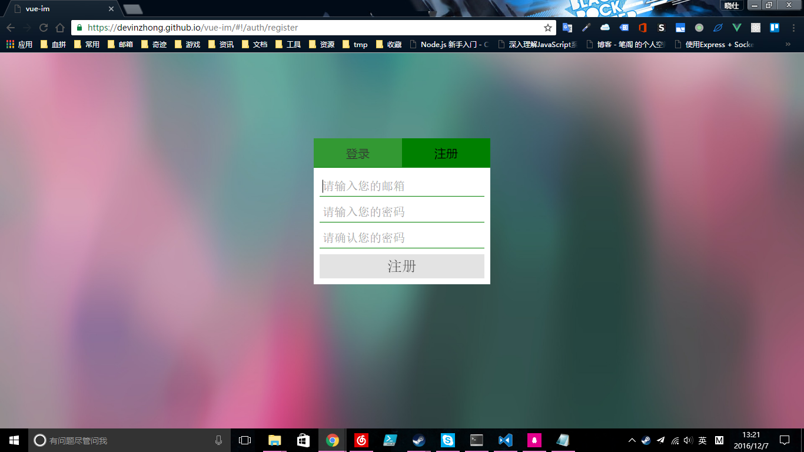
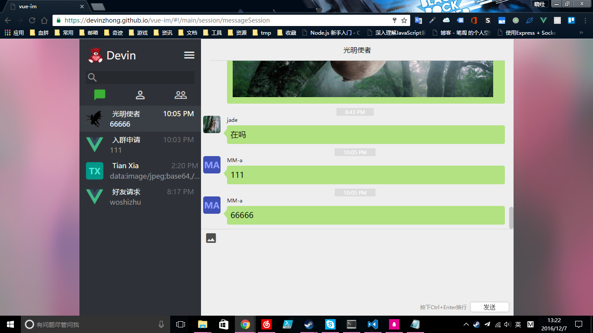
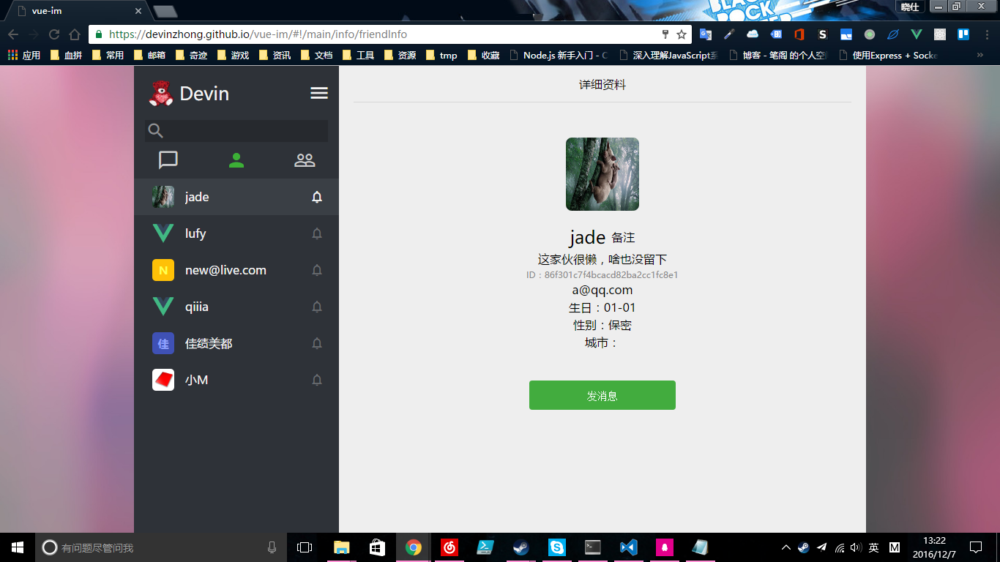
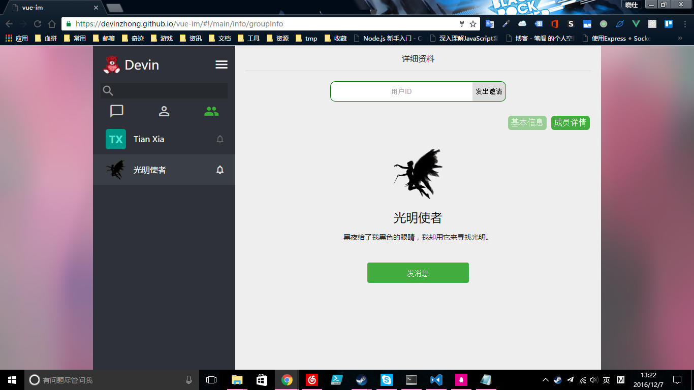
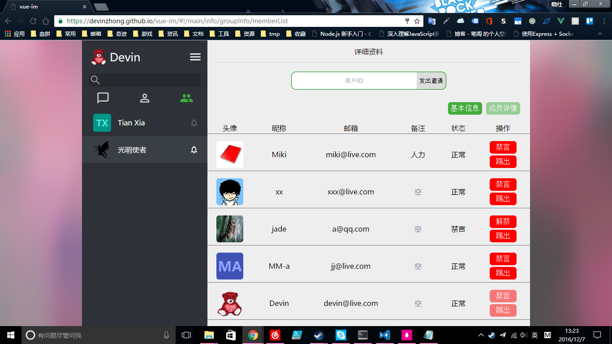

# vue-im

> 一个模仿微信的即时通讯单页应用。用vue做界面，使用野狗做后端服务。

**项目状态：开发中**

你可以访问[demo](https://devinzhong.github.io/vue-im)以预览应用效果

**目前在Chrome下访问正常，其他浏览器未测试，目测会很蛋疼**

## Screenshots
### 登录与注册界面


### 聊天会话界面


### 好友信息界面


### 群组基本信息界面


### 群组管理界面



## Build Setup

1. 本应用基于野狗后端服务，你可以到野狗开一个免费的个人项目用于测试（据说野狗和firebase使用相同的API接口，或许也能兼容，本人未测试）
2. 然后你需要将规则文件内容复制到野狗并保存，规则文件为根目录下的`rules.json`
3. 你需要到`src/shared/constants.js`里面，将rootRef指向你的野狗应用，即修改一下参数里的URL
4. 接着以下标准步骤：

``` bash
# install dependencies
# 这里建议使用代理，比如 https://github.com/rofl0r/proxychains-ng
npm install
# proxychains4 npm install 如果使用proxychains-ng将会是这样

# serve with hot reload at localhost:8080
npm run dev

# build for production with minification
npm run build

# run unit tests
# npm run unit

# run all tests
# npm test
```


## What's next ?
- 修复bug，完善功能
- 补充单元测试与注释
- 优化性能
